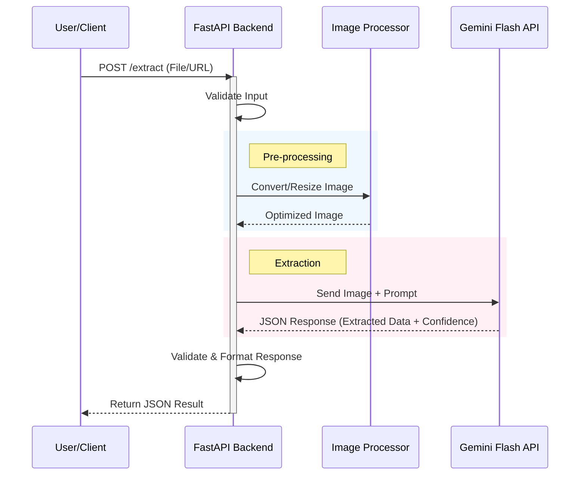
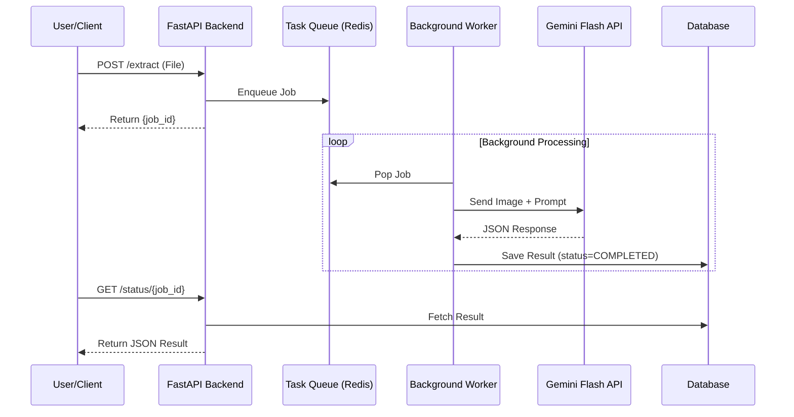

# System Workflow Diagrams

## 1. POC Workflow (Synchronous)
This flow is designed for simplicity and immediate feedback, suitable for the initial Proof of Concept (10 docs/day).

## 2. Production Workflow (Asynchronous)
This flow is designed for high volume (1000+ docs/day) to prevent timeouts and handle spikes.

